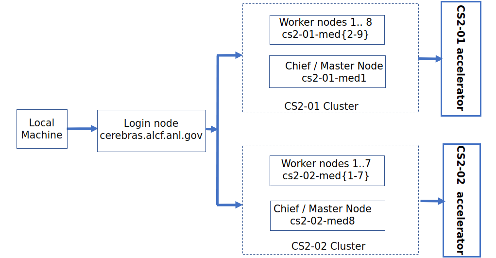

# Cerebras Getting Started

## On Boarding 

Follow steps 1 and 2 on [ALCF AI Testbed User Guide]("https://www.alcf.anl.gov/support-center/get-started") to request an account.

## System View


Connection to a CS-2 node is a two-step process. The first step requires a MFA passcode for authentication - either a 8 digit passcode generated by an app on your mobile device (e.g. mobilePASS+) or a CRYPTOCard-generated passcode prefixed by a 4 digit pin. 

In the examples below, replace `ALCFUserID` with your ALCF user id.

To connect to a CS-2 ("chief") node:<br>

1. From the local machine, ssh to the login node first: 
    ```bash
    ssh ALCFUserID@cerebras.alcf.anl.gov
    ```
2. From the login node, ssh to the destination CS-2 chief node:
    ```bash
    ssh cs2-01-master
   # or
    ssh cs2-02-master
    ```


# BERT (language model)

Bidirectional Encoder Representations from Transformers (BERT) is a transformer-based machine learning technique for natural language processing (NLP) pre-training developed by Google. Here are instructions to running it on Cerebras system. 


* BERT Code is in the [Bert](./bert/) directory. For your convenience, these scripts are also available locally. 

* Login to CS-2:  
    ```bash
    ssh ALCFUserID@cerebras.alcf.anl.gov 
    ssh cs2-01-med1
    ```

* Copy bert scripts to youyr `$HOME` directory. 
    ```bash
    cp -r /software/cerebras/model_zoo ~/  
    cd model_zoo/modelzoo/transformers/tf/bert  
    ```
    Note : Ignore any permissions errors during the copy of the subdirectory `modelzoo-R1.3.0_2/`.


* Modify `data_dir` to `'/software/cerebras/dataset/bert_large/msl128/'` in `configs/params_bert_large_msl128.yaml`, **in two locations**.
  * Refer to config file [here](./bert/configs/params_bert_large_msl128.yaml) for reference.

* The CS-2 systems use slurm for job submission and queueing. Please refer to [Cerebras Documentation](https://www.alcf.anl.gov/support/ai-testbed-userdocs/cerebras/Job-Queuing-and-Submission/index.html) for further details. 
  
  * **Run scripts on CPU:**   `csrun_cpu` is used to run a cpu-only job on one or more worker nodes.
    ```bash
    $ MODELDIR=model_dir_bert_large_msl128_$(hostname)  
    $ rm -r $MODELDIR  
    $ time -p csrun_cpu python run.py --mode=train --compile_only --params configs/params_bert_large_msl128.yaml --model_dir $MODELDIR --cs_ip $CS_IP  
    ```
  * **Run scripts on CS-2:** `csrun_wse` is used to run a job on both the wafer scale engine and one or more worker nodes.
    ```bash
    $ MODELDIR=model_dir_bert_large_msl128_$(hostname)  
    $ rm -r $MODELDIR 
    $ time -p csrun_wse python run.py --mode=train --params configs/params_bert_large_msl128.yaml --model_dir $MODELDIR --cs_ip $CS_IP
    ```
