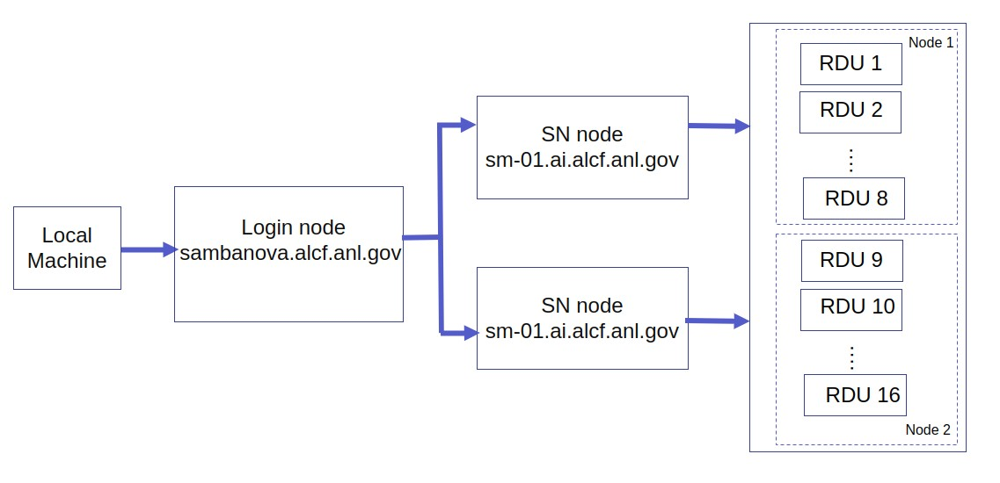

# Sambanova Getting Started

## On Boarding

See [ALCF AI Testbed User Guide](https://www.alcf.anl.gov/support-center/get-started) to request an account and additional information.

## System View

Connection to a SambaNova node is a two-step process. The first step is to `ssh` to the `login node`. This step requires an MFA passcode for authentication. Eight-digit passcode generated by an app on your mobile device, e.g., mobilePASS+.
The second step is to log in to a SambaNova node from the `login node`.



## Connect to Login Node

* Login to the SambaNova login node from your local machine using the below command. This uses the MobilePass+ token generated every time you log in to the system. 

    In the examples below, replace `ALCFUserID` with your ALCF user id.

    ```bash
    $ ssh ALCFUserID@sambanova.alcf.anl.gov
    ALCFUserID@sambanova.alcf.anl.gov password: < MobilePass+ code >
    ```

    Note: Use the ssh "-v" option in order to debug any ssh problems.


* Once you are on the login node, the SambaNova system can be accessed using the alias `sm-01` or `sm-02`.

    ```bash
    $ ssh sm-01
    # or
    $ ssh sm-02
    ```

    **NOTE:** There is just one scheduler for both sm-01 and sm-02. Run the python scripts using srun or sbatch, to ensure that concurrent jobs do not interfere with each other.

## SambaFlow SDK setup

* The SambaNova system has a bash shell script to set up the required software environment. This sets up the SambaFlow software stack, and the associated environmental variables and starts a pre-configured virtual environment.

    ```bash
    ALCFUserID@sm-01:~$ source /software/sambanova/envs/sn_env.sh
    ```

* The contents of the `sn_env.sh` script is shown below for convenience.

  * Setup the path to SambaFlow software stack. This stack includes the Runtime, the compilers, and the SambaFlow Python SDK which is used to create and run models.
      ```bash
      alias snpath='export PATH=$PATH:/opt/sambaflow/bin' 
      ```

  * The `OMP_NUM_THREADS` environment variable sets the number of threads to use for parallel regions. The value of this environment variable must be a list of positive integer values. The values of the list set the number of threads to use for parallel regions at the corresponding nested levels. For the SambaNova system, it is usually set to 1.
      ```bash
      alias snthreads='export OMP_NUM_THREADS=16'
      ```

  * This starts the pre-configured virtual environment that consists of sambaflow and other built-in libraries.
      ```bash
      alias snvenv='source /opt/sambaflow/venv/bin/activate' 
      ```

    **Note:**  SambaNova operations will fail unless the SambaNova `venv` is set up.

* You may deactivate the environment when finished.
    ```bash
    $ deactivate
    ```


# Steps to run BERT-Large on Sambanova

* BERT Code is in the [Bert](./bert/) directory here.  
  * [transformners_hook.py](./bert/transformers_hook.py): contains code for BERT.

## Getting started

1. Login to Sambanova login node. 
    ```bash
    $ ssh ALCFUserID@sambanova.alcf.anl.gov
    ```

2. Connect to the one of the destination Sambanova nodes:  
    ```bash
    $ ssh sm-01 
    or 
    $ ssh sm-02
    ```
    
3. Set up the required software environment. Do:
     ```bash
    $ source /software/sambanova/envs/sn_env.sh
    ```

## Pretraining in data parallel mode

**Note**: for the sake of the tutorial, we have precompiled the model to reduce the execution time. 

1. Create a folder for pretraining in your home repo, and copy the bash script `/projects/aitestbed_training/SN/precompiled_bert/bash_scripts/submit-bert-pretrain-job-LBS1024.sh` to it. Then, go to that folder. Example:

   ```bash
   $ cd $HOME
   $ mkdir pretrain
   $ cp /projects/aitestbed_training/SN/precompiled_bert/bash_scripts/submit-bert-pretrain-job-LBS1024.sh pretrain/
   $ cd pretrain/
   ```

2. Open the `submit-bert-pretrain-job-LBS1024.sh` file, and change `OUTDIR` to location of the pretrain folder. Example: 

   ```bash
   OUTDIR=$HOME/pretrain
   ```
   Note: the per device batch size (LBS) is set to 1024 here.  

3. SambaNova uses SLURM for job submission and queueing. We will use sbatch to submit our job to the job scheduler. Please refer to [Sambanova Documentation](https://www.alcf.anl.gov/support/ai-testbed-userdocs/sambanova/Job-Queuing-and-Submission/index.html) for further details. In the following example, 2 RDUs are used:

   ```bash
   $ sbatch --output=log_bert_pretrain_LBS1024_np2.out --gres=rdu:2 -c 8 submit-bert-pretrain-job-LBS1024.sh
   ```
   Note: `-c` represents the number of cores per task  
      
4. You can follow the status of your job using: `squeue`. The job should take about 8 min to complete.

5. Once the job is completed, you can see the checkpoint(s) and accuracy metrics in `hf_output_lrg_run/`. The throughput is outputted in the `log_bert_pretrain_LBS1024_np2.out` file (search for throughput in the file).

    <details>
    <summary>Click for sample throughput</summary>

    ```bash
    Measuring peformance with world size:  2
    initial run starts.
    initial run completes.
    e2e_latency: 30.75621747970581 seconds, throughput: 665.8816225861821 samples/s, measured over 10 iterations.
    NOTE: This is the combined throughput for 2 workers
    total duration: 30.75621747970581 s
    ```

    </details>
    
    <details>
    <summary>Click for sample train_steps.txt</summary>

    ```bash
    10
    20
    30
    40
    50
    60
    70
    80
    90
    100
    ```

    </details>
    
    <details>
    <summary>Click for sample step_loss.txt</summary>

    ```bash
    11.16291
    10.76511
    10.44571
    10.16663
    9.98203
    9.85561
    9.76017
    9.66340
    9.57864
    9.50137
    ```

    </details>

## Fine-tuning for question answering using 1 RDU

**Note**: for the sake of the tutorial, we have precompiled the model to reduce the execution time. 

1. Create a folder for finetuning in your home repo, and copy the bash script `/projects/aitestbed_training/SN/precompiled_bert/bash_scripts/submit-bert-squad-job.sh` to it. Then, go to that folder. Example:

   ```bash
   $ cd $HOME
   $ mkdir finetune
   $ cp /projects/aitestbed_training/SN/precompiled_bert/bash_scripts/submit-bert-squad-job.sh finetune/
   $ cd finetune/
   ```

2. Open the `submit-bert-pretrain-job-LBS1024.sh` file, and change `OUTDIR` to location of the finetune folder. Example: 

   ```bash
   OUTDIR=$HOME/finetune
   ``` 

3. SambaNova uses SLURM for job submission and queueing. We will use sbatch to submit our job to the job scheduler. Please refer to [Sambanova Documentation](https://www.alcf.anl.gov/support/ai-testbed-userdocs/sambanova/Job-Queuing-and-Submission/index.html) for further details. In the following example, 1 RDU is used: 

   ```bash
   $ sbatch --output=log_bert_squad.out --gres=rdu:1 -c 8 submit-bert-squad-job.sh
   ```
      
4. You can follow the status of your job using: `squeue`. The job should take about 20 min to complete. Note: for finetuning, data is not pre-tokenized and will be tokenized on the fly, that is why the job is taking longer to complete.

5. Once the job is completed, you can see the checkpoint(s) and accuracy metrics in `hf_output_squad_run/`.

    <details>
    <summary>Click for sample log_history.json</summary>

    ```bash
    [
      {
         "exact": 54.33301797540208,
         "f1": 66.54507382283774,
         "epoch": 0.07965242577842144,
         "total_flos": 5419063617454080,
         "step": 220
       }
    ]    
    ```

    </details>
    
    <details>
    <summary>Click for sample eval_results_squad.txt</summary>

    ```bash
    exact = 54.33301797540208
    f1 = 66.54507382283774
    epoch = 0.07965242577842144
    total_flos = 5419063617454080
    ```

    </details>

# Other Models and Use-cases

* Full execution scripts (compile, run, measure-perf) for BERT-Large can be found under `/projects/aitestbed_training/SN/full_execution_bert/bash_scripts`:
  * `submit-bert-pretrain-job.sh`: bash script for pretraining job with 8 RDUs and LBS=256
  * `submit-bert-squad-job.sh`: bash script for fine-tuning job for question answering with 1 RDU 

* See [Example Programs](https://www.alcf.anl.gov/support/ai-testbed-userdocs/sambanova/Example-Programs/index.html) for instructions to run other well-known AI applications on SambaNova hardware (e.g., LeNet, FFN-MNIST, logistic regression, UNet)
