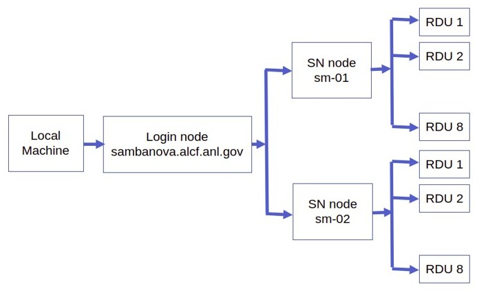

# Sambanova Getting Started

## On Boarding

See [ALCF AI Testbed User Guide](https://www.alcf.anl.gov/support-center/get-started) to request an account and additional information.

## System View

Connection to a SambaNova node is a two-step process. The first step is to `ssh` to the `login node`. This step requires an MFA passcode for authentication. Eight-digit passcode generated by an app on your mobile device, e.g., mobilePASS+.
The second step is to log in to a SambaNova node from the `login node`.



## Connect to Login Node

* Login to the SambaNova login node from your local machine using the below command. This uses the MobilePass+ token generated every time you log in to the system. This is the same passcode used to authenticate into other ALCF systems, such as Theta and Cooley.

    In the examples below, replace `ALCFUserID` with your ALCF user id.

    ```bash
    $ ssh ALCFUserID@sambanova.alcf.anl.gov
    ALCFUserID@sambanova.alcf.anl.govs password: < MobilePass+ code >
    ```

    Note: Use the ssh "-v" option in order to debug any ssh problems.


* Once you are on the login node, the SambaNova system can be accessed using the alias `sm-01` or `sm-02`.

    ```bash
    $ ssh sm-01
    # or
    $ ssh sm-02
    ```

    **NOTE:** `sm-01` and `sm-02` each have a separate scheduler.  If you have already ssh'd into one of those nodes, you are all set.

## SambaFlow SDK setup

* The SambaNova system has a bash shell script to set up the required software environment. This sets up the SambaFlow software stack, and the associated environmental variables and starts a pre-configured virtual environment.

    ```bash
    ALCFUserID@sm-01:~$ source /software/sambanova/envs/sn_env.sh
    ```

* The contents of the `sn_env.sh` script is shown below for convenience.

  * Setup the path to SambaFlow software stack. This stack includes the Runtime, the compilers, and the SambaFlow Python SDK which is used to create and run models.
      ```bash
      alias snpath='export PATH=$PATH:/opt/sambaflow/bin' 
      ```

  * The `OMP_NUM_THREADS` environment variable sets the number of threads to use for parallel regions. The value of this environment variable must be a list of positive integer values. The values of the list set the number of threads to use for parallel regions at the corresponding nested levels. For the SambaNova system, it is usually set to 1.
      ```bash
      alias snthreads='export OMP_NUM_THREADS=16'
      ```

  * This starts the pre-configured virtual environment that consists of sambaflow and other built-in libraries.
      ```bash
      alias snvenv='source /opt/sambaflow/venv/bin/activate' 
      ```

    **Note:**  SambaNova operations will fail unless the SambaNova `venv` is set up.

* You may deactivate the environment when finished.
    ```bash
    $ deactivate
    ```

## BERT-Large on Sambanova

Bidirectional Encoder Representations from Transformers (BERT) is a transformer-based machine learning technique for natural language processing (NLP) pre-training developed by Google. Here are instructions to running it on Sambanova system. 

* BERT Code is in the [Bert](./bert/) directory here.  
  * [transformners_hook.py](./bert/transformers_hook.py): contains code for BERT.
  * [bert_train-inf.sh](./bert//bert_train-inf.sh): contains driver code to run and profile BERT. 
  * For your convenience, these scripts are also available locally on each machine. 
    Copy them to youyr `$HOME` directory. 
    ```bash
    $ cp /var/tmp/Additional/slurm/Models/ANL_Acceptance_RC1_11_5/bert_train-inf.sh ~/
    ```

* SambaNova uses Slurm for job submission and queueing. We will use `srun` to submit our job to job scheduler. Please refer to [Sambanova Documentation](https://www.alcf.anl.gov/support/ai-testbed-userdocs/sambanova/Job-Queuing-and-Submission/index.html) for further details. 
    ```bash
    $ cd ~
    $ srun bert_train-inf.sh
    ```

<!-- * The sample output of `bert_train-inf.sh` can be found in [bert_output.txt](./bert_output.txt) -->